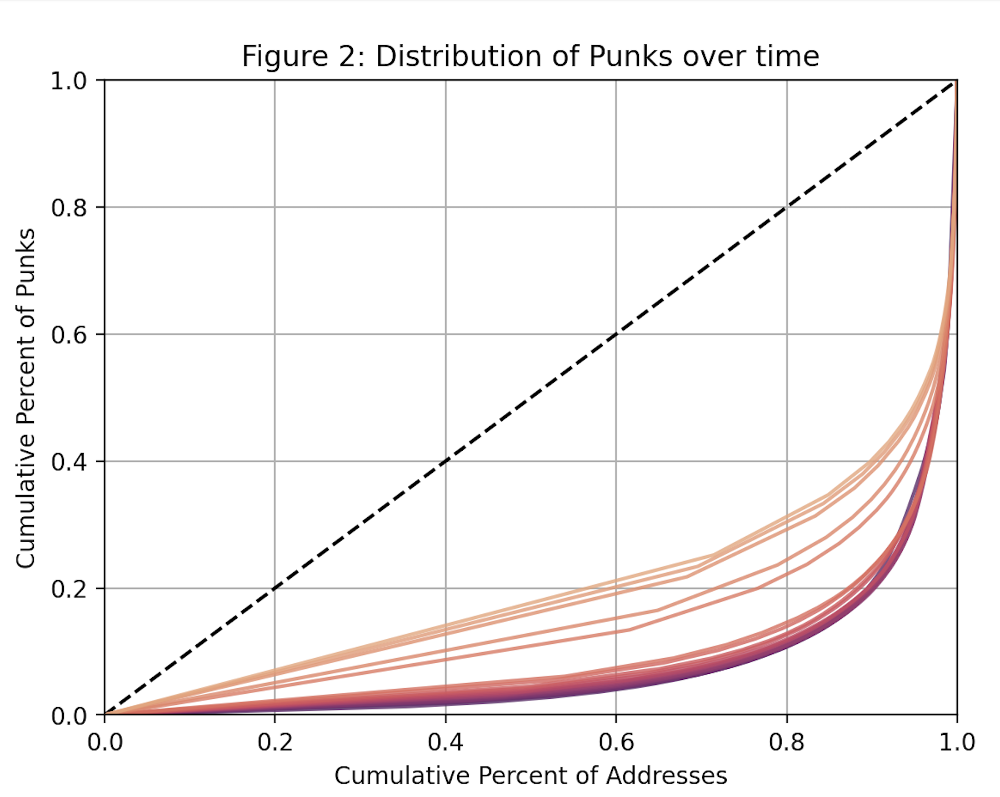

# Punks Analysis


_Distribution of CryptoPunks over time (blue: oldest -> orange: newest)_

## Summary

This repository contains Python code written to investigate the distribution of [CryptoPunks](https://www.larvalabs.com/cryptopunks) over time. It uses `web3py` to interact with an Ethereum node via [Infura](https://infura.io) and collects all claim, transfer and sale logs broadcasted from the CryptoPunks [smart contract](https://etherscan.io/address/0xb47e3cd837dDF8e4c57F05d70Ab865de6e193BBB), which is then parsed and cleaned.

The data is used to determine how the Punks NFTs are distributed across addresses. I graph Lorenz Curves and calculate Gini Coefficients to quantify the degree of inequality.

For a more comprehensive discussion of CryptoPunks, my results and some limitations of the investigation, I did a [write-up on my website](https://emilio.co.za/write/cryptopunks).

## Usage

The repository already includes a set of logs (under the `data` directory prefixed with `event_`) which may be used to analyze other aspects of the CryptoPunks market. The graphs are in the `figures` directory.

What follows is instructions to gather, clean and graph the data from scratch.

Firstly, clone the project and install the requirements.

```console
emilio@MPB:~$ git clone https://github.com/emilioziniades/punks-analysis
emilio@MPB:~$ cd punks-analysis
emilio@MPB:~$ pip install -r requirements.txt

```

Next, you will also need to get an auth key from Infura. Head over to their [website](https://infura.io), create an account if you do not have one, go to your dashboard, create a new project and go to the project settings. We want the 'Project ID'. `punks-analysis` reads this Project ID from the `WEB3_INFURA_PROJECT_ID` environment variable. Either manually create a new environment variable via the command line

```console
emilio@MBP:~$ export WEB3_INFURA_PROJECT_ID=abcdef123456...
```

or create a file named `.env` in the code directory and include this line

`/code/.env`:

```
WEB3_INFURA_PROJECT_ID=abcdef124567
```

Now that you have the relevant auth key, you should also delete the data and figures directories.

```console
emilio@MBP:~/punks-analysis$ rm -rf data && rm -rf figures
```

Now you, you can run `main.py` and the data will be fetched, cleaned, parsed and graphed.

**NOTE:** This project requires Python version 3.9.10.

```console
emilio@MBP:~/punks-analysis$ python3 ./code/main.py
```

You should see progress messages in the terminal output. This process may take anywhere from 10 minutes to 30 minutes. Results are stored in the `data` and `figures` directories.

## Contributing

If you identify any bugs, please feel free to open an issue or submit a pull request if you are willing to fix it.

Since this is a research project, I am not really looking to implement any new features. Having said that, it would be pretty trivial to adapt this project to fetch logs from _any_ smart contract. If you're interested in doing this, let me know and I would gladly assist.
